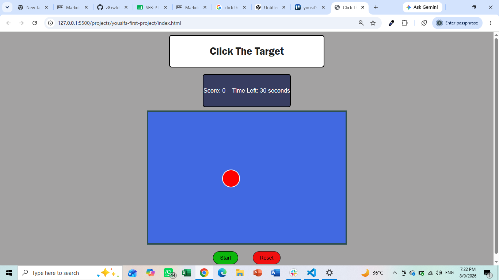
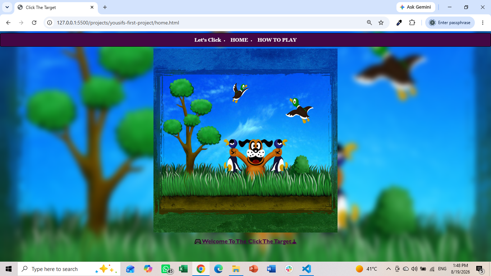
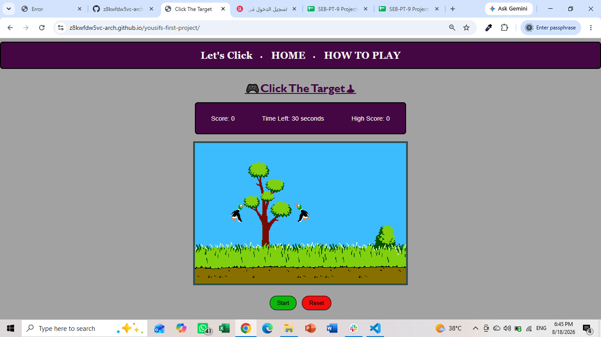

# Project Name
CLICK THE TARGET game

## Technologies Used
HTML
css
java script
## Description
a simple game with a moving target which the user has to click and get a higher score, like makeing a competiton to get the higher score it's depending on reflexes and how fast the player can go
## User Stories
*As a user, i want to click the start button to start the game.
*As a user, i want the target to change position randomly and catch many of it
*As a user, my score to increase after every time a catch the target
*As a user, i want the game to stop automatically when the time hits zero(0)
*As i user, i want a reset button to clear everything and start a new game

## Screenshots

First version i have made:

After adding a layout and background:

Updated to another layout:

Final touches:

## Future Enhancements
1.Adding a local storege so it let the player to save all his recoreds and make a compete for the highest socore and the fastest player.
2.Adding more then character of animation, and evrey character have a different value or score count .
3.Adding some levels from easy to exterem.
## Credits
1- I would like to thank our instructors : Omer Kamal, Jameela, AND Sayed Hamed for teaching supporting snd keep us motavaited.
2- Youtube channels: like kenny Yip, magdyBytes, bro code, pitiIT and more.
3- Teaching websites like W3Schools , GeeksforGeeks, Stack overflow and more 
4- Most helper GA lectuers and labs, 
